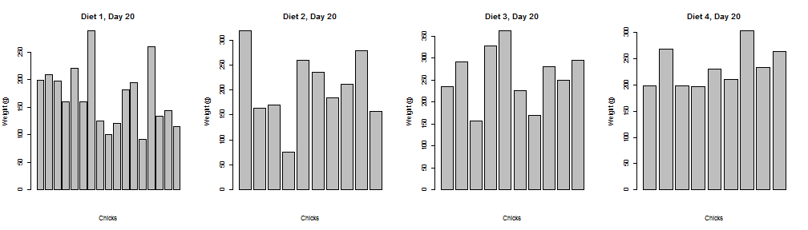
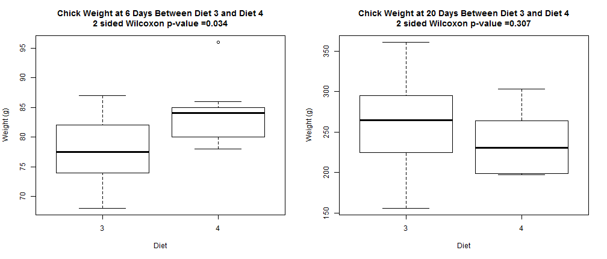

install.packages("knitr")
---
title       : Effect of Diet on Weight
subtitle    : Coursera Developing Data Products

## What do you feed to chicks to maximize their growth?

Somebody did an experiment to find out!

We've collected data with daily measurements of groups of chicks raised on 4 different diets.

However, how do we find out which diet was best from the resulting measurments?

---

## Making sense of our measurements

It is difficult to determine which diet is best when looking at the weights of all the chicks at 20 days old.

What about on different days? Is one diet better than another when looking at different timelines?

---

## This tool allows you to make an informed decision! 

You can compare between diets, and even check the weights at different days

Diet 4 yields significantly bigger chicks as of 6 days of age, but by 20 days, that difference is gone!

---

## Conclusion

Explore the comparisons between different diets on different days yourself!

